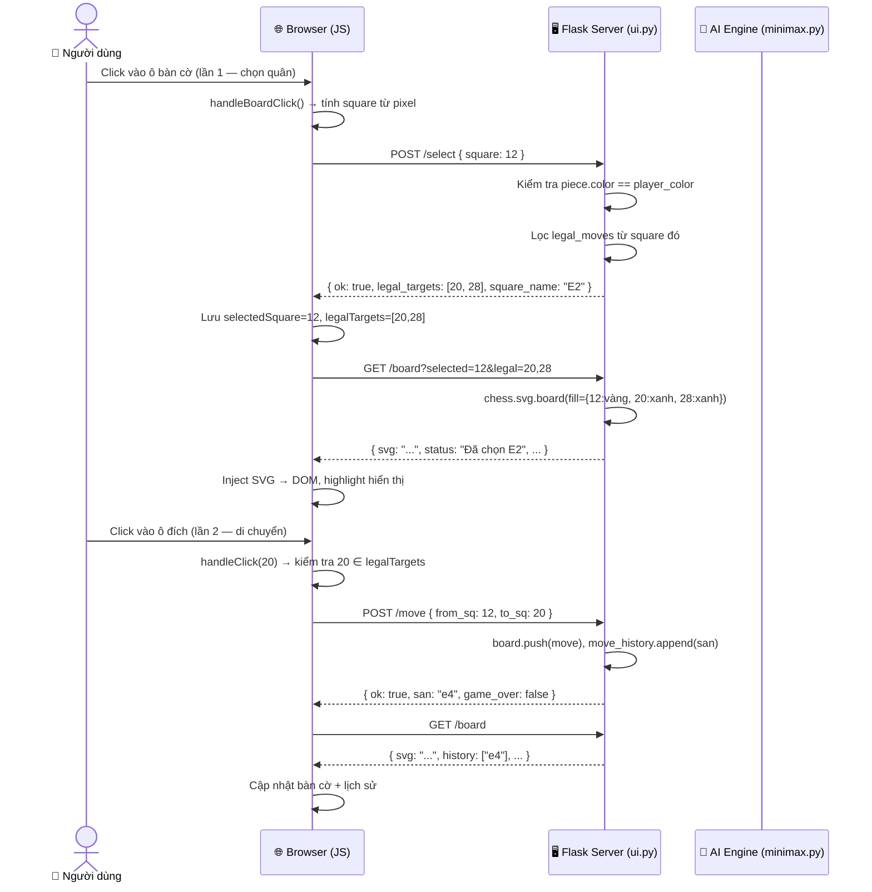
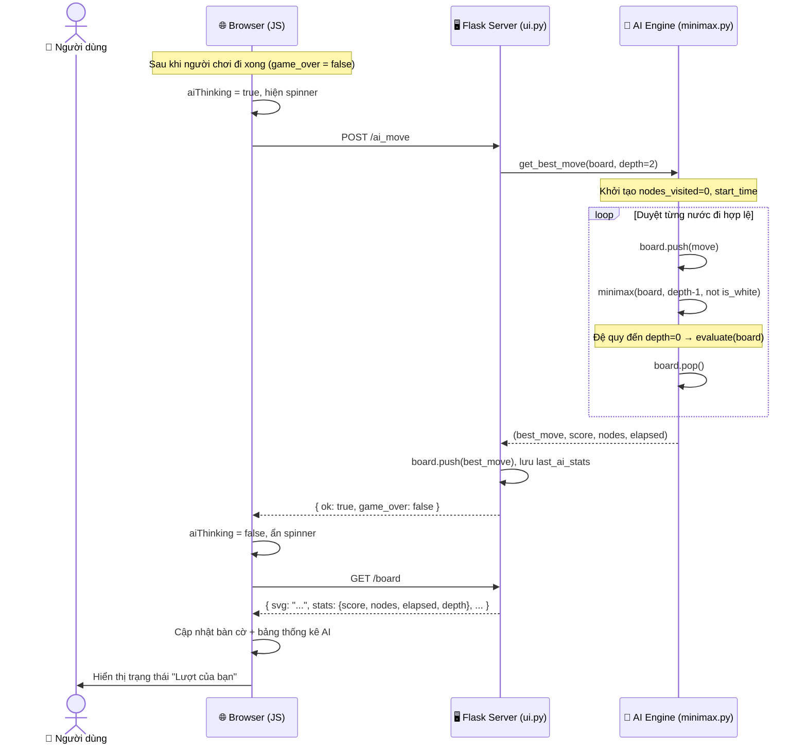
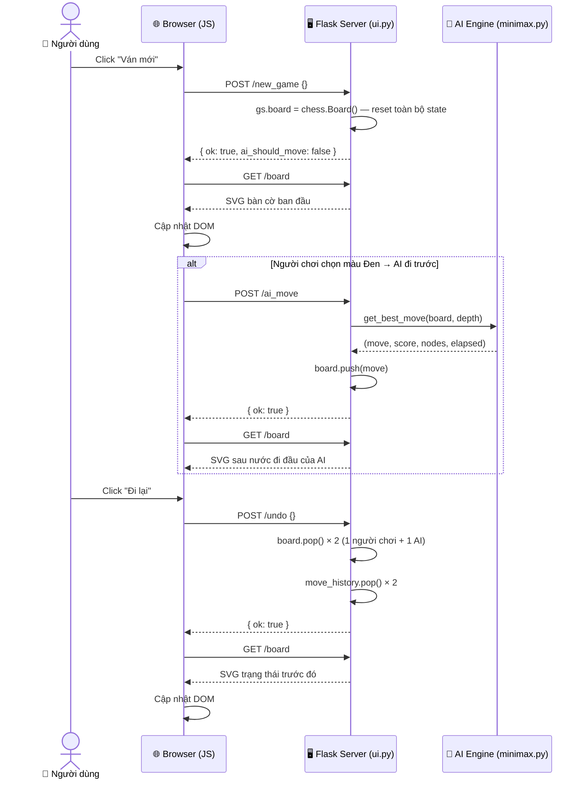

> **Phiên bản:** 2.0 | **Thuật toán:** Minimax + Alpha-Beta (có thể bật/tắt bằng `USE_ALPHA_BETA`) | **UI:** Flask + chess.svg

---

## 1. Kiến trúc thư mục
```text
chess_ai/
├── main.py                  # Điểm khởi chạy duy nhất: khởi tạo ClickToMoveUI và gọi run()
├── ai/
│   ├── __init__.py
│   └── minimax.py           # Thuật toán tìm kiếm: minimax() + get_best_move()
├── game/
│   ├── __init__.py
│   └── game_logic.py        # Hàm đánh giá vị trí: PIECE_VALUES + evaluate()
├── ui/
│   ├── __init__.py
│   └── ui.py                # Toàn bộ tầng UI: Flask server + HTML/CSS/JS + GameState
└── requirements.txt         # Danh sách phụ thuộc chạy project
```

| File | Vai trò | Phụ thuộc vào |
|---|---|---|
| `main.py` | Entry point, khởi động game | `ui/ui.py` |
| `ai/minimax.py` | Thuật toán Minimax, chọn nước đi tốt nhất | `game/game_logic.py` |
| `game/game_logic.py` | Đánh giá điểm vị trí bàn cờ | `python-chess` |
| `ui/ui.py` | Flask server, render SVG, xử lý REST API, HTML template | `ai/minimax.py` |

---

## 2. Pipeline Thuật toán (Backend)

### Tổng quan luồng xử lý
```text
Board State
  -> get_best_move(board, depth)
      -> Duyệt từng nước đi hợp lệ ở tầng gốc
          board.legal_moves -> [move_1, move_2, ..., move_n]
    -> Với mỗi nước đi: gọi minimax_ab(...) hoặc minimax(...) tùy `USE_ALPHA_BETA`
          -> Base case: depth == 0 hoặc game_over
              -> evaluate(board) -> trả về điểm số
          -> Recursive case:
              -> MAX node (lượt Trắng): chọn max() trên các nhánh con
              -> MIN node (lượt Đen): chọn min() trên các nhánh con
  -> Trả về: (best_move, best_score, nodes_visited, elapsed)
```

### Mô tả từng bước

**Bước 1 — Input:**
`get_best_move` nhận vào `board` (trạng thái bàn cờ hiện tại) và `depth` (độ sâu tìm kiếm). Xác định AI đang đi màu nào qua `board.turn`.

**Bước 2 — Legal Moves (tầng gốc):**
Duyệt `board.legal_moves`, thực hiện từng nước bằng `board.push(move)`, sau đó gọi `minimax()` cho cây con, cuối cùng hoàn tác bằng `board.pop()`.

**Bước 3 — Recursion (đệ quy):**
Hàm `minimax()` tự gọi lại với `depth - 1` và đảo `is_maximizing`. Mỗi lần gọi tăng biến `nodes_visited[0]` lên 1 để theo dõi hiệu suất.

**Bước 4 — Evaluation (điều kiện dừng):**
Khi `depth == 0` hoặc `board.is_game_over()`, gọi `evaluate(board)` từ `game_logic.py`. Hàm đánh giá chỉ đếm vật chất: cộng giá trị quân Trắng, trừ giá trị quân Đen.

| Trường hợp đặc biệt | Giá trị trả về |
|---|---|
| Chiếu hết, Trắng thua | `-99999` |
| Chiếu hết, Đen thua | `+99999` |
| Hòa (stalemate, lặp, v.v.) | `0` |
| Bình thường | Tổng giá trị vật chất |

**Bước 5 — Output:**
`get_best_move` trả về tuple `(best_move, best_score, nodes_visited[0], elapsed)` cho tầng UI tiêu thụ.

### Độ phức tạp

| Depth | Số nodes lý thuyết | Thời gian ước tính |
|---|---|---|
| 1 | ~30 | < 0.01s |
| 2 | ~900 | ~0.05s |
| 3 | ~27,000 | ~1–3s |
| 4 | ~810,000 | ~30–90s |

> **Ghi chú:** Branching factor trung bình của cờ vua ~30 nước/lượt.
> Ở code hiện tại, Version 2 đã tích hợp Alpha-Beta Pruning để giảm đáng kể số node duyệt trong thực tế.

### 2.1 Cắt tỉa Alpha-Beta (đang dùng ở V2)

Alpha-Beta là tối ưu của Minimax: vẫn cho ra cùng kết quả nước đi tốt nhất,
nhưng bỏ qua các nhánh chắc chắn không thể cải thiện kết quả hiện tại.

| Biến | Ý nghĩa |
|---|---|
| `alpha` | Điểm tốt nhất hiện biết cho MAX (cận dưới) |
| `beta` | Điểm tốt nhất hiện biết cho MIN (cận trên) |

Điều kiện cắt tỉa:

- Ở MAX node: sau khi cập nhật `alpha`, nếu `alpha >= beta` thì dừng duyệt các nhánh còn lại.
- Ở MIN node: sau khi cập nhật `beta`, nếu `beta <= alpha` thì dừng duyệt các nhánh còn lại.

Pseudo code:

```python
def minimax_ab(board, depth, alpha, beta, is_maximizing):
    if depth == 0 or board.is_game_over():
        return evaluate(board)

    if is_maximizing:
        value = -10**9
        for move in board.legal_moves:
            board.push(move)
            value = max(value, minimax_ab(board, depth - 1, alpha, beta, False))
            board.pop()
            alpha = max(alpha, value)
            if alpha >= beta:
                break
        return value
    else:
        value = 10**9
        for move in board.legal_moves:
            board.push(move)
            value = min(value, minimax_ab(board, depth - 1, alpha, beta, True))
            board.pop()
            beta = min(beta, value)
            if beta <= alpha:
                break
        return value
```

So sánh độ phức tạp:

| Thuật toán | Độ phức tạp xấu nhất | Thực tế thường gặp |
|---|---|---|
| Minimax thuần | `O(b^d)` | Tăng rất nhanh theo depth |
| Minimax + Alpha-Beta | `O(b^d)` | Gần `O(b^(d/2))` nếu move ordering tốt |

Checklist kiểm tra tích hợp trong code hiện tại:

1. Đã có hàm `minimax_ab()` trong `ai/minimax.py` nhận `alpha`, `beta`.
2. Đã khởi tạo ở tầng gốc với `alpha=-inf`, `beta=+inf`.
3. Đã có điều kiện cắt tỉa và `break` ở cả MAX/MIN node.
4. Interface `get_best_move()` vẫn giữ nguyên để UI tương thích.
5. Có cờ `USE_ALPHA_BETA` để bật/tắt so sánh giữa V1 và V2.

---

## 3. Pipeline Giao diện (Frontend/Interaction)

### Luồng Click-to-Move hoàn chỉnh
1. Người dùng click lên bàn cờ SVG, JavaScript gọi `handleBoardClick(event)`.
2. JS quy đổi tọa độ pixel sang ô cờ (`square`) theo kích thước `420x420` và trạng thái `flipped`.
3. JS gọi `handleClick(square)` với 2 trạng thái:

```text
Bước 1 (chưa chọn quân)
- POST /select { square }
- Server kiểm tra quân của người chơi + nước đi hợp lệ
- Trả về { ok, legal_targets[], square_name }
- JS lưu selectedSquare, legalTargets và refreshBoard() để highlight

Bước 2 (đã chọn quân)
- Click lại ô cũ -> bỏ chọn
- Click quân mình khác -> chọn lại quân mới
- Click ô hợp lệ -> POST /move { from_sq, to_sq }
- Server push move + lưu SAN/history
- JS refreshBoard()
- Nếu chưa game_over -> POST /ai_move
- JS refreshBoard() lần cuối
```

### Cập nhật DOM sau mỗi refreshBoard()

`GET /board?selected=&legal=` trả về JSON gồm:

| Trường JSON | Ánh xạ DOM | Hàm JS |
|---|---|---|
| `svg` | `#board-container innerHTML` | `refreshBoard()` |
| `captured` | `#captured-text` | `refreshBoard()` |
| `history[]` | `#history-body` (bảng HTML) | `updateHistoryUI()` |
| `stats{}` | `#stats-content` | `updateStatsUI()` |
| `status` | `#status-text` | `updateStatusUI()` |

---

## 4. Sequence Diagram (Sơ đồ trình tự)

### 4.1 Luồng người chơi đi một nước



### 4.2 Luồng AI phản hồi



### 4.3 Luồng ván mới / đi lại



---

## 5. Cài đặt và chạy (đầy đủ)

### 5.1 Yêu cầu môi trường

- Python 3.10 trở lên.
- pip phiên bản mới.

### 5.2 Tải source code

```bash
git clone https://github.com/<your-username>/<your-repo>.git
cd <your-repo>/chess_ai
```

### 5.3 Tạo virtual environment

Windows (PowerShell):

```powershell
python -m venv .venv
.\.venv\Scripts\Activate.ps1
```

Windows (cmd):

```bat
python -m venv .venv
.venv\Scripts\activate.bat
```

macOS/Linux:

```bash
python3 -m venv .venv
source .venv/bin/activate
```

### 5.4 Cài dependencies

```bash
pip install --upgrade pip
pip install -r requirements.txt
```

> **Lưu ý đồng bộ:** UI hiện tại dùng Flask. Nếu môi trường chưa có Flask, cài thêm:
>
> ```bash
> pip install flask
> ```

### 5.5 Chạy ứng dụng

```bash
python main.py
```

Mở trình duyệt tại:

```text
http://127.0.0.1:5678
```

### 5.6 Kiểm tra nhanh sau cài đặt

1. Trang chủ mở được và hiển thị bàn cờ.
2. Click chọn quân thấy ô hợp lệ được highlight.
3. Đi một nước xong AI phản hồi, log không có `405 /ai_move`.

---

## 6. Lưu ý khi push lên GitHub

### 6.1 Những thứ không nên commit

1. Thư mục môi trường ảo: `.venv/`, `venv/`.
2. Cache Python: `__pycache__/`, `*.pyc`.
3. File hệ điều hành/editor: `.DS_Store`, `.vscode/` (nếu có setting cá nhân).
4. Secret, token, API key, cookie, file chứa mật khẩu.

### 6.2 Nên có file .gitignore

Ví dụ nhanh:

```gitignore
# Python
__pycache__/
*.py[cod]

# Virtual environment
.venv/
venv/

# IDE/OS
.vscode/
.DS_Store
```

### 6.3 Checklist trước khi push

1. Chạy app local thành công bằng `python main.py`.
2. Kiểm tra `requirements.txt` đúng dependency cần thiết.
3. Đảm bảo README cập nhật đúng cách chạy và ảnh minh họa.
4. Dùng commit message rõ ràng, ví dụ: `docs: add alpha-beta section and setup guide`.

### 6.4 Lệnh push cơ bản

```bash
git add .
git commit -m "docs: update README with alpha-beta, install, and github notes"
git branch -M main
git remote add origin https://github.com/<your-username>/<your-repo>.git
git push -u origin main
```

## 7. Ghi chú kỹ thuật

| Vấn đề | Giải pháp trong V1 |
|---|---|
| AI đơ UI khi tính toán | Không — V1 dùng Flask synchronous (UI block trong lúc chờ `/ai_move`) |
| Font chess symbol | Dùng `chess.svg` của python-chess thay vì Unicode |
| Flipped board | `chess.svg.board(flipped=True)` + JS tính lại `square` từ pixel |
| Phong cấp | Mặc định phong Hậu — lọc `m.promotion == chess.QUEEN` |